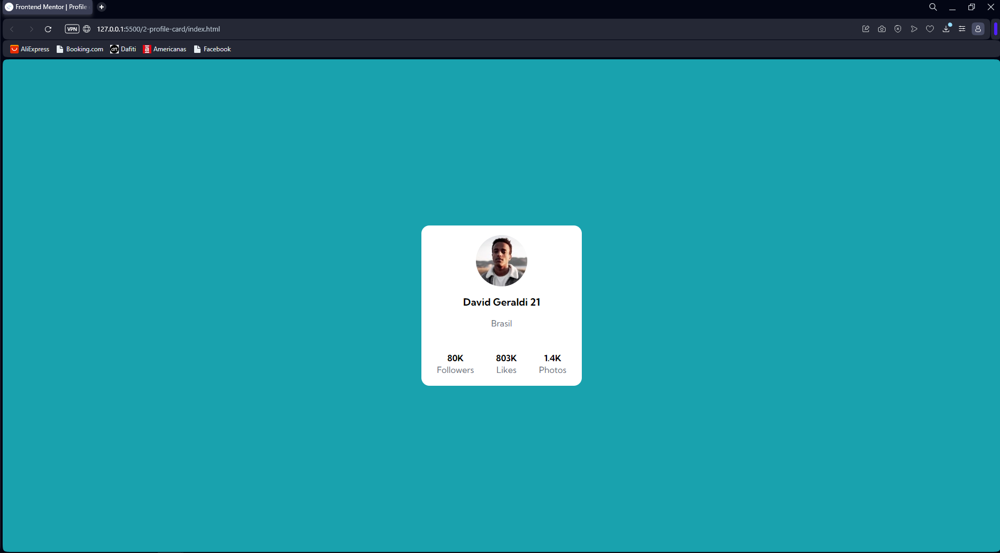
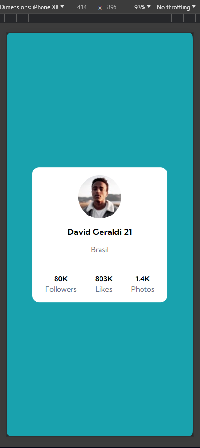

# Card Profile

Desafio para criar um cartão de perfil centralizado no painel, com as informações do perfil pessoal.

## Resultado da página para Desktop:

## Resultado responsivo para mobile:

## O que aprendi com este desafio:
Com este desafio aprendi a centraliza o elemento pai no centro do painel e utilizando os conceitos de flex container e flex box para alinhas todos os elementos.

## Tecnologias utilizadas:

 
    <ul>
        <li>HTML 5
        
        </li>
      
    <li>CSS 3
        
    </li>

